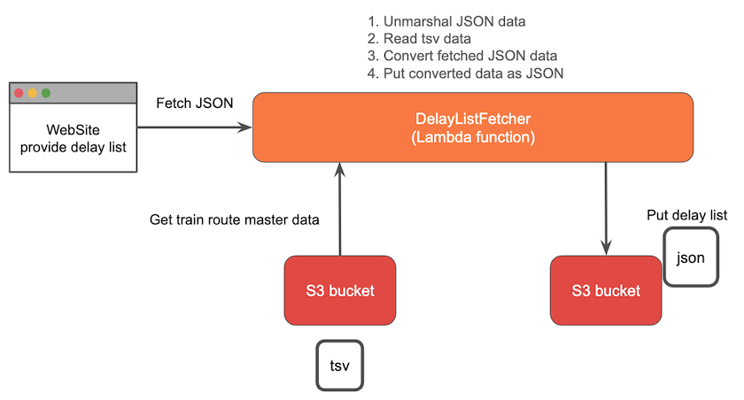

# DelayListFetcher

## About

This is a lambda function which can fetch train-delay-list from [鉄道遅延情報のJSON](<https://rti-giken.jp/fhc/api/train_tetsudo/>) and put to S3 bucket.

This function mainly fetch delay-list and convert the JSON to contain all of train route name and each status.

The information is used in [遅れトレイン](<https://train-delay-reporter.netlify.com/>)

Below is a brief explanation of what we have generated for you:

```bash
.
├── Makefile                    <-- Make to automate build
├── README.md                   <-- This instructions file
├── src                         <-- Source code for a lambda function
├── docker-compose.yaml         <-- Build minio container
└── template.yaml
```

## Requirements

* AWS CLI already configured with Administrator permission
* [Docker installed](https://www.docker.com/community-edition)
* [Golang](https://golang.org)
* [Minio](<https://min.io/>)

## Overall flow

The function basicly consist of four process.

1. Fetch a JSON data from [鉄道遅延情報のJSON](<https://rti-giken.jp/fhc/api/train_tetsudo/>) and unmarshal it to Go object.
2. Read tsv data which contain all of train route name and region and convert to Go object. It also obtain from [鉄道遅延情報のJSON](<https://rti-giken.jp/fhc/api/train_tetsudo/>).
3. Convert two Go object and create new Go object which convert to use each application easily.
4. Finally, marshal the Go object and create JSON file and upload it to S3 bucket.



## Setup process

### Installing dependencies

In this example we use the built-in `go get` and the only dependency we need is AWS Lambda Go SDK:

```shell
go get -u github.com/aws/aws-lambda-go/...
```

**NOTE:** As you change your application code as well as dependencies during development, you might want to research how to handle dependencies in Golang at scale.

### Building

When you try to try this function, you need to setup local S3 environment.

This function use [Minio](<https://min.io/>) to imitate bucket to put JSON file. To setup this environment, exec this command.

```bash
sam local setup-dev
```


### Local development

To execute lambda function in local environment, exec this command.

```bash
sam local exec-dev
```

## Packaging and deployment

AWS Lambda Golang runtime requires a flat folder with the executable generated on build step. SAM will use `CodeUri` property to know where to look up for the application:

```yaml
...
    FirstFunction:
        Type: AWS::Serverless::Function
        Properties:
            CodeUri: src/
            ...
```

To deploy your application for the first time, run the following in your shell:

```bash
sam deploy --guided
```

### Testing

```shell
go test ./...
```
# Appendix

### Golang installation

Please ensure Go 1.x (where 'x' is the latest version) is installed as per the instructions on the official golang website: https://golang.org/doc/install

A quickstart way would be to use Homebrew, chocolatey or your linux package manager.

#### Homebrew (Mac)

Issue the following command from the terminal:

```shell
brew install golang
```

If it's already installed, run the following command to ensure it's the latest version:

```shell
brew update
brew upgrade golang
```

#### Chocolatey (Windows)

Issue the following command from the powershell:

```shell
choco install golang
```

If it's already installed, run the following command to ensure it's the latest version:

```shell
choco upgrade golang
```

## Bringing to the next level

Here are a few ideas that you can use to get more acquainted as to how this overall process works:

* Create an additional API resource (e.g. /hello/{proxy+}) and return the name requested through this new path
* Update unit test to capture that
* Package & Deploy

Next, you can use the following resources to know more about beyond hello world samples and how others structure their Serverless applications:

* [AWS Serverless Application Repository](https://aws.amazon.com/serverless/serverlessrepo/)

# Reference

* Train-delay-list fetch from...
  * [鉄道遅延情報のJSON](<https://rti-giken.jp/fhc/api/train_tetsudo/>)